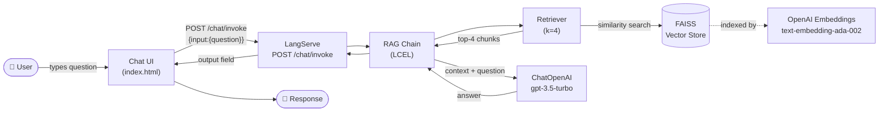

# Promtior Chatbot — Technical Overview

## 1. Project Overview

This chatbot answers questions about Promtior using **Retrieval Augmented Generation (RAG)**. Rather than relying solely on an LLM's pre-trained knowledge, the system first retrieves relevant passages from Promtior's own content and then feeds them to the model as grounding context. This makes answers accurate and up-to-date without fine-tuning.

### Pipeline

1. **Data Ingestion** (`app/ingest.py`)
   - **Web scraping**: `WebBaseLoader` fetches and parses https://promtior.ai via BeautifulSoup, extracting clean text from the live website.
   - **PDF loading**: `PyPDFLoader` loads `data/promtior.pdf` page by page. If the file is absent, a warning is emitted and the pipeline continues with the web content alone — the system is never hard-blocked by a missing file.
   - **Chunking**: `RecursiveCharacterTextSplitter` splits documents into 1,000-character chunks with 200-character overlap, balancing context richness against embedding window limits.
   - **Embedding**: Each chunk is embedded with OpenAI's `text-embedding-ada-002` model.
   - **FAISS index**: Embeddings are stored in a local FAISS index saved to `./vectorstore/`. On subsequent starts the index is loaded from disk — no re-embedding needed unless the data changes.

2. **RAG Chain** (`app/chain.py`)
   - A retriever fetches the top 4 most semantically similar chunks for a given question.
   - A `ChatPromptTemplate` injects those chunks as context into a system message.
   - `ChatOpenAI(model="gpt-3.5-turbo", temperature=0)` generates a grounded, deterministic answer.
   - The chain is composed with LangChain Expression Language (LCEL) and exposed via LangServe.

3. **API** (`app/main.py`)
   - FastAPI serves the LangServe endpoint at `/chat/invoke` and a static chat UI at `/`.
   - The vector store is warmed up on startup so the first request has low latency.

### Main Challenges & Solutions

| Challenge | Solution |
|---|---|
| Missing PDF at build/run time | `FileNotFoundError` caught with `warnings.warn`; pipeline continues with web data |
| Stale web content | Re-run `ingest.py` or delete `./vectorstore/` to force re-scraping on next start |
| Cold start latency | Vector store loaded eagerly in the `lifespan` handler, not on first request |

---

## 2. Component Diagram



---

## 3. Data Sources

| Source | Loader | Content |
|---|---|---|
| https://promtior.ai | `WebBaseLoader` | Company overview, services, team, use cases, blog posts |
| `data/promtior.pdf` | `PyPDFLoader` | Supplementary documentation (brochures, case studies, etc.) |

The website is the primary source for questions like "What services does Promtior offer?" and "When was the company founded?". The PDF extends coverage with any materials not published on the public site.

---

## 4. How to Run Locally

```bash
# 1. Clone the repo
git clone <repo-url>
cd promtior-chatbot

# 2. Create your .env file
cp .env.example .env
# Edit .env and set OPENAI_API_KEY=sk-...

# 3. Install dependencies (Python 3.11 recommended)
pip install -r requirements.txt

# 4. (Optional) Add the Promtior PDF
cp /path/to/promtior.pdf data/promtior.pdf

# 5. Start the server
uvicorn app.main:app --reload --port 8000
```

Open http://localhost:8000 in your browser.

The vector store is built automatically on first run and cached in `./vectorstore/`. To force a rebuild (e.g. after updating data sources), delete that directory and restart.

---

## 5. Deployment — Railway

Railway was chosen over AWS EC2 because:
- OpenAI API handles LLM inference externally — no need for a high-RAM instance
- Railway free tier (512 MB RAM) is sufficient for the FastAPI + FAISS application
- Zero infrastructure management required

Deploy steps:
1. Push code to GitHub
2. Connect repo to Railway
3. Set `OPENAI_API_KEY` in Railway **Variables** tab
4. Railway builds and deploys automatically via `Dockerfile`
5. Generate a public domain in **Settings → Networking**

Cost: $0 infrastructure + ~$0.05–0.10 OpenAI API usage for evaluation.
