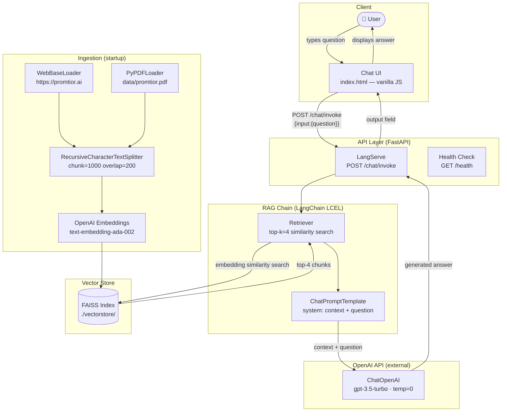

# Promtior Chatbot — Technical Documentation

---

## 1. Project Overview

### Approach

The challenge asked for a chatbot capable of answering questions about Promtior accurately. The key decision was to **not rely on the LLM's pre-trained knowledge alone**, since GPT-3.5 has no specific knowledge about Promtior. Instead, I implemented a **RAG (Retrieval Augmented Generation)** architecture: the system first retrieves relevant passages from Promtior's own content, then feeds them as grounding context to the LLM before generating a response.

This approach guarantees that answers are based on real, up-to-date information from the company — not hallucinated content.

### Implementation Logic

The solution is structured in three layers:

**1. Ingestion layer** — runs once at startup and builds a searchable knowledge base:
- Scrapes the live content of https://promtior.ai using `WebBaseLoader` (LangChain + BeautifulSoup4)
- Loads a local PDF document (`data/promtior.pdf`) using `PyPDFLoader`
- Splits all text into 1,000-character chunks with 200-character overlap using `RecursiveCharacterTextSplitter`
- Embeds every chunk using OpenAI's `text-embedding-ada-002` model
- Stores the resulting vectors in a local **FAISS** index, persisted to disk so it is only built once

**2. RAG chain layer** — runs on every user question:
- Converts the user's question into an embedding and performs a similarity search against the FAISS index, retrieving the top 4 most relevant chunks
- Injects those chunks as context into a `ChatPromptTemplate` system message
- Sends the full prompt to `gpt-3.5-turbo` with `temperature=0` for deterministic answers
- The chain is composed using **LangChain Expression Language (LCEL)** and served via **LangServe**

**3. API + UI layer**:
- **FastAPI** exposes the LangServe endpoint at `POST /chat/invoke` and a health check at `GET /health`
- A vanilla JS single-page chat UI is served at `GET /` with a dark theme and suggestion chips

### Main Challenges and How They Were Solved

| Challenge | Solution |
|---|---|
| The LLM has no knowledge of Promtior | RAG: ground every answer in retrieved chunks from Promtior's actual content |
| PDF may not always be present | `FileNotFoundError` is caught gracefully — the pipeline continues with web data alone, never crashing |
| Rebuilding embeddings on every restart is slow and costly | FAISS index is persisted to `./vectorstore/`; on subsequent starts it is loaded from disk in milliseconds |
| Railway doesn't expose `OPENAI_API_KEY` at build time | The Dockerfile has no pre-build ingest step — the vector store is built at runtime on first startup |
| Missing API key should fail visibly, not silently | Startup handler checks for `OPENAI_API_KEY` and logs a clear error if absent, instead of crashing the process |

---

## 2. Component Diagram

The diagram below shows all components involved from the moment the user submits a question until the response is displayed.



> The **Ingestion** subgraph runs once at server startup (or when the vectorstore directory does not exist). The **Query** flow runs on every user message.

---

## 3. Data Sources

| Source | Loader | What it provides |
|---|---|---|
| https://promtior.ai | `WebBaseLoader` (BeautifulSoup4) | Company overview, services offered, team, use cases, blog posts — live content |
| `data/promtior.pdf` | `PyPDFLoader` | Supplementary documentation not published on the public website |

Both sources are chunked and embedded into the same FAISS index, so retrieval is transparent across them. If the PDF is absent, the system logs a warning and continues with web content only.

---

## 4. Tech Stack

| Layer | Technology | Version |
|---|---|---|
| Language | Python | 3.11 |
| API framework | FastAPI + LangServe | 0.111.0 / 0.1.0 |
| RAG orchestration | LangChain (LCEL) | 0.1.20 |
| LLM | OpenAI gpt-3.5-turbo | via API |
| Embeddings | OpenAI text-embedding-ada-002 | via API |
| Vector store | FAISS (local, CPU) | 1.8.0 |
| Web scraping | WebBaseLoader + BeautifulSoup4 | 4.12.3 |
| PDF parsing | PyPDF | 4.2.0 |
| Server | Uvicorn | 0.29.0 |
| Deployment | Railway (Dockerfile) | — |

---

## 5. How to Run Locally

```bash
# 1. Clone the repo
git clone <repo-url>
cd promtior-chatbot

# 2. Set your OpenAI API key
cp .env.example .env
# Edit .env → OPENAI_API_KEY=sk-...

# 3. Install dependencies
pip install -r requirements.txt

# 4. (Optional) Add the Promtior PDF
cp /path/to/promtior.pdf data/promtior.pdf

# 5. Start the server
uvicorn app.main:app --reload --port 8000
```

Open http://localhost:8000. The vector store is built automatically on first run and cached in `./vectorstore/`. To force a rebuild, delete that directory and restart.

Alternatively, using Docker Compose:

```bash
docker compose up -d --build
```

---

## 6. Deployment — Railway

Railway was chosen because:
- OpenAI API handles LLM inference externally — no high-RAM instance needed
- Railway's free tier (512 MB RAM) is sufficient for FastAPI + FAISS
- Zero server management — connects directly to the GitHub repo and deploys via `Dockerfile`

### Deploy steps

1. Push the repository to GitHub (confirm `.env` is gitignored)
2. Go to https://railway.app → **New Project → Deploy from GitHub repo**
3. Select the repository
4. In **Variables** tab, add: `OPENAI_API_KEY = sk-...`
5. Railway detects `Dockerfile` and `railway.json` automatically and deploys
6. Go to **Settings → Networking → Generate Domain** to get the public URL
7. Verify: `curl https://your-app.railway.app/health` → `{"status":"ok"}`

**Cost**: $0 infrastructure + ~$0.05–0.10 in OpenAI API usage for evaluation purposes.
