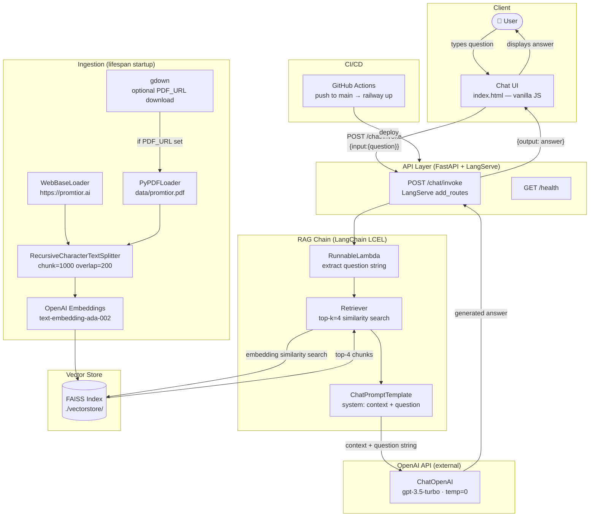

# Promtior Chatbot — Technical Documentation

---

## 1. Project Overview

### Approach

GPT-3.5 has no knowledge of Promtior, so relying on the model alone was never an option. I went with a RAG architecture: pull relevant content from Promtior's website and a PDF document, embed it into a vector store, and retrieve the most relevant chunks before each LLM call. That way the model answers from actual company information, not from guessing.

The main tradeoff I considered was simplicity vs. accuracy. A fine-tuned model would be more powerful but way overkill for this scope. RAG with FAISS keeps everything local and fast, with no external database to manage.

### Implementation Logic

**Ingestion** (runs once on startup): scrapes https://promtior.ai with `WebBaseLoader`, loads `data/promtior.pdf` with `PyPDFLoader`, splits everything into 1,000-character chunks with 200-character overlap, embeds them with `text-embedding-ada-002`, and saves the FAISS index to disk. On subsequent restarts it loads from disk instead of rebuilding.

**RAG chain** (runs on every question): takes the user's question, retrieves the top 4 most similar chunks from FAISS, injects them as context into a prompt template, and calls `gpt-3.5-turbo` with `temperature=0`. Built with LangChain LCEL and served through LangServe.

**API + UI**: FastAPI handles routing. The chain is registered via `add_routes` during the `lifespan` startup event. A vanilla JS chat UI is served at `/`.

### Main Challenges and How They Were Solved

| Challenge | Solution |
|---|---|
| The LLM has no knowledge of Promtior | RAG: ground every answer in retrieved chunks from Promtior's actual content |
| PDF may not always be present | `FileNotFoundError` caught gracefully — pipeline continues with web data alone |
| Rebuilding embeddings on every restart is slow | FAISS index persisted to `./vectorstore/`; loaded from disk on subsequent starts |
| Railway health check times out during long startup | `healthcheckTimeout` set to 300s in `railway.json` to allow vectorstore build time |
| `$PORT` env var not expanding in Railway `startCommand` | Dockerfile uses shell form `CMD uvicorn ... --port ${PORT:-8000}` |
| Missing API key should fail visibly | Startup `lifespan` handler checks for `OPENAI_API_KEY` and logs a clear error |
| Google Drive returning HTML instead of PDF | `gdown` with `fuzzy=True` + magic bytes validation (`%PDF` header check) |

---

## 2. Component Diagram

The diagram below shows all components involved from the moment the user submits a question until the response is displayed.



> The **Ingestion** subgraph runs once on server startup via the FastAPI `lifespan` handler. If a `./vectorstore/` directory already exists on disk, it is loaded directly (no re-embedding). The **Query** flow runs on every user message.

---

## 3. Data Sources

| Source | Loader | What it provides |
|---|---|---|
| https://promtior.ai | `WebBaseLoader` (BeautifulSoup4) | Company overview, services offered, team, use cases, blog posts — live content |
| `data/promtior.pdf` | `PyPDFLoader` | Supplementary documentation not published on the public website |

Both sources are chunked and embedded into the same FAISS index, so retrieval is transparent across them. If the PDF is absent, the system logs a warning and continues with web content only.

Optionally, if the `PDF_URL` environment variable is set, the PDF is downloaded automatically at startup using `gdown` (handles Google Drive confirmation pages). A magic bytes check (`%PDF` header) validates the download before ingestion.

---

## 4. Tech Stack

| Layer | Technology | Version |
|---|---|---|
| Language | Python | 3.11 |
| API framework | FastAPI + LangServe | 0.111.0 / 0.1.0 |
| RAG orchestration | LangChain (LCEL) | 0.1.20 |
| LLM | OpenAI gpt-3.5-turbo | via API |
| Embeddings | OpenAI text-embedding-ada-002 | via API |
| Vector store | FAISS (local, CPU) | 1.8.0 |
| Web scraping | WebBaseLoader + BeautifulSoup4 | 4.12.3 |
| PDF parsing | PyPDF | 4.2.0 |
| PDF download | gdown | 5.1.0 |
| Server | Uvicorn | 0.29.0 |
| Deployment | Railway (Dockerfile) | — |
| CI/CD | GitHub Actions | — |

---

## 5. How to Run Locally

```bash
# 1. Clone the repo
git clone https://github.com/valegg/promtior-chatbot.git
cd promtior-chatbot

# 2. Set your OpenAI API key
cp .env.example .env
# Edit .env → OPENAI_API_KEY=sk-...

# 3. Install dependencies
pip install -r requirements.txt

# 4. Start the server
uvicorn app.main:app --reload --port 8000
```

Open http://localhost:8000. The vector store is built at startup and cached in `./vectorstore/`. To force a rebuild, delete that directory and restart.

Alternatively, using Docker Compose:

```bash
docker compose up -d --build
```

---

## 6. Deployment — Railway

**Live URL**: https://promtior-chatbot-production-e196.up.railway.app

Railway was chosen because:
- OpenAI API handles LLM inference externally — no high-RAM instance needed
- Railway's free tier (512 MB RAM) is sufficient for FastAPI + FAISS
- Zero server management — connects directly to the GitHub repo and deploys via `Dockerfile`

### Deploy steps

1. Push the repository to GitHub (confirm `.env` is gitignored)
2. Go to https://railway.app → **New Project → Deploy from GitHub repo**
3. Select the repository
4. In **Variables** tab, add:
   ```
   OPENAI_API_KEY = sk-...
   PORT = 8000
   ```
5. Railway detects `Dockerfile` and `railway.json` automatically and deploys
6. Go to **Settings → Networking → Generate Domain** to get the public URL
7. Verify: `curl https://promtior-chatbot-production-e196.up.railway.app/health` → `{"status":"ok"}`

**Cost**: $0 infrastructure + ~$0.05–0.10 in OpenAI API usage for evaluation purposes.

---

## 7. CI/CD — GitHub Actions

Every push to `main` triggers `.github/workflows/deploy.yml` which:
1. Installs the Railway CLI
2. Deploys the latest code via `railway up --detach`
3. Waits 30 seconds for the container to start
4. Hits `/health` and fails the pipeline if it doesn't return HTTP 200

Required GitHub secrets: `RAILWAY_TOKEN`, `RAILWAY_PUBLIC_URL`.
